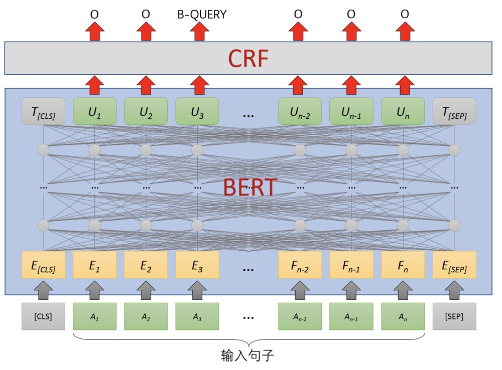

# 基于BERT-NER模型的命名实体识别/中文query抽取模型


## 1.数据预处理

数据集标注方式：BIO
- B-QUERY、I-QUERY代表query首字、query中间字
- S-QUERY代表单字构成的query
- O待标该字不属于query的一部分

query处理方式：
- 去掉`@+用户昵称`
- 去掉`#`符号
- 去掉所有非中文和字母的字符

caption处理方式：
- 去除caption = ‘’
- 在query处理方式的基础上，保留常见中文字符，如`，`、`。`、`：`、`！`、`——`等，起到语义分割作用

数据示例：
其中`caption_pro`是模型的输入token，`query`是监督信息，`query_index`是token labels。
```text
{"photo_id": 53811314170, 
 "caption": " #林更新  #赵丽颖  #超好看的古装剧 ", 
 "query": "林更新赵丽颖", 
 "caption_pro": "林更新赵丽颖超好看的古装剧", 
 "query_index": ["B-QUERY", "I-QUERY", "I-QUERY", "I-QUERY", "I-QUERY", "I-QUERY", "O", "O", "O", "O", "O", "O", "O"]}
```

## 2.模型架构


### BERT
BERT使用了多层Transformer结构，通过Attention机制将任意位置的两个单词的距离转换为1，有效解决了nlp中的长期依赖问题。在海量语料上训练完的BERT模型可以应用到下游的nlp任务中，只需要在BERT的基础上再添加一个输出层便可完成对特定任务的fine-tune。

对于NER任务，在fine-tune时将整个句子作为输入，在每个时间片输出一个概率，通过简单的softmax就可以得到这个token的实体类别。

### CRF（条件随机场）
HMM模型中存在两个假设
1. 输出状态值之间严格独立；
2. 状态转移过程中当前状态只与前一状态有关；

也就是说，在NER的场景下，HMM认为观测到的句子中的每个字都是相互独立的，而且当前时刻的标注只与前一时刻的标注相关。但实际上，命名实体识别往往需要更多的特征，比如词性、词的上下文等等，同时当前时刻的标注应该与前一时刻以及后一时刻的标注都相关联。
因此CRF通过引入自定义的特征函数，不仅可以表达观测之间的依赖，还可表示当前观测与前后多个状态之间的复杂依赖，可以有效克服HMM模型面临的问题。

## 3.模型评估

### 模型对比

1. BERT+Softmax
2. BERT+CRF
3. BERT+Span

### 准召指标
- 随机10%验证集:

|              | Precision  | Recall   | F1 score   |   train loss   | eval loss
| ------------ | ------------------ | ------------------ | ------------------ | ------------------ | ------------------ |
| BERT+Softmax | - | - | - | - | - |
| BERT+CRF     | 0.5770 | 0.5739 | 0.5754 | 1.574 | 2.105 |
| BERT+Span    | - | - | - | - | - |
| BERT+Span+adv    | - | - | - | - | - |
| BERT-small(6 layers)+Span+kd    | - | - | - | - | - |
| BERT+Span+focal_loss    | - | - | - | - | - |
| BERT+Span+label_smoothing   | - | - | - | - | - |

- 明星类测试集结果

|              | Precision | Recall   | F1 score | test loss |
| ------------ | ------------------ | ------------------ | ------------------ | ------------------ |
| BERT+Softmax | - | - | - | - |
| BERT+CRF     | 0.4553 | 0.4436 | 0.4494 | 3.676 |
| BERT+Span    | - | - | - | - |
| BERT+Span+adv    | - | - | - | - |
| BERT-small(6 layers)+Span+kd    | - | - | - | - |
| BERT+Span+focal_loss    | - | - | - | - |
| BERT+Span+label_smoothing   | - | - | - | - |


- 资讯类测试集结果

|              | Precision | Recall   | F1 score | test loss |
| ------------ | ------------------ | ------------------ | ------------------ | ------------------ |
| BERT+Softmax | - | - | - | - |
| BERT+CRF     | 0.3887 | 0.3709 | 0.3796 | 4.379 |
| BERT+Span    | - | - | - | - |
| BERT+Span+adv    | - | - | - | - |
| BERT-small(6 layers)+Span+kd    | - | - | - | - |
| BERT+Span+focal_loss    | - | - | - | - |
| BERT+Span+label_smoothing   | - | - | - | - |

- 通用类测试集结果
- 
|              | Precision | Recall   | F1 score | test loss |
| ------------ | ------------------ | ------------------ | ------------------ | ------------------ |
| BERT+Softmax | - | - | - | - |
| BERT+CRF     | 0.3537 | 0.3284 | 0.3406 | 4.836 |
| BERT+Span    | - | - | - | - |
| BERT+Span+adv    | - | - | - | - |
| BERT-small(6 layers)+Span+kd    | - | - | - | - |
| BERT+Span+focal_loss    | - | - | - | - |
| BERT+Span+label_smoothing   | - | - | - | - |


## 4.运行模型
1. 修改 `run_ner_xxx.py` 或者 `run_ner_xxx.sh` 的配置信息
2. 运行脚本`bash scripts/run_ner_xxx.sh`
### requirement
1. 1.1.0 =< PyTorch < 1.5.0
2. cuda=9.0
3. python3.6+

**note**: 预训练模型的文件结构

```text
├── prev_trained_model
|  └── bert_base
|  |  └── pytorch_model.bin
|  |  └── config.json
|  |  └── vocab.txt
|  |  └── ......
```

## 通用数据集效果
### 通用数据集地址
1. cner: datasets/cner
2. CLUENER: https://github.com/CLUEbenchmark/CLUENER
### CLUENER result
The overall performance of BERT on **dev**:

|              | Accuracy (entity)  | Recall (entity)    | F1 score (entity)  |
| ------------ | ------------------ | ------------------ | ------------------ |
| BERT+Softmax | 0.7897     | 0.8031     | 0.7963    |
| BERT+CRF     | 0.7977 | 0.8177 | 0.8076 |
| BERT+Span    | 0.8132 | 0.8092 | 0.8112 |
| BERT+Span+adv    | 0.8267 | 0.8073 | **0.8169** |
| BERT-small(6 layers)+Span+kd    | 0.8241 | 0.7839 | 0.8051 |
| BERT+Span+focal_loss    | 0.8121 | 0.8008 | 0.8064 |
| BERT+Span+label_smoothing   | 0.8235 | 0.7946 | 0.8088 |
### ALBERT for CLUENER
The overall performance of ALBERT on **dev**:

| model  | version       | Accuracy(entity) | Recall(entity) | F1(entity) | Train time/epoch |
| ------ | ------------- | ---------------- | -------------- | ---------- | ---------------- |
| albert | base_google   | 0.8014           | 0.6908         | 0.7420     | 0.75x            |
| albert | large_google  | 0.8024           | 0.7520         | 0.7763     | 2.1x             |
| albert | xlarge_google | 0.8286           | 0.7773         | 0.8021     | 6.7x             |
| bert   | google        | 0.8118           | 0.8031         | **0.8074**     | -----            |
| albert | base_bright   | 0.8068           | 0.7529         | 0.7789     | 0.75x            |
| albert | large_bright  | 0.8152           | 0.7480         | 0.7802     | 2.2x             |
| albert | xlarge_bright | 0.8222           | 0.7692         | 0.7948     | 7.3x             |
### Cner result
The overall performance of BERT on **dev(test)**:

|              | Accuracy (entity)  | Recall (entity)    | F1 score (entity)  |
| ------------ | ------------------ | ------------------ | ------------------ |
| BERT+Softmax | 0.9586(0.9566)     | 0.9644(0.9613)     | 0.9615(0.9590)     |
| BERT+CRF     | 0.9562(0.9539)     | 0.9671(**0.9644**) | 0.9616(0.9591)     |
| BERT+Span    | 0.9604(**0.9620**) | 0.9617(0.9632)     | 0.9611(**0.9626**) |
| BERT+Span+focal_loss    | 0.9516(0.9569) | 0.9644(0.9681)     | 0.9580(0.9625) |
| BERT+Span+label_smoothing   | 0.9566(0.9568) | 0.9624(0.9656)     | 0.9595(0.9612) |
